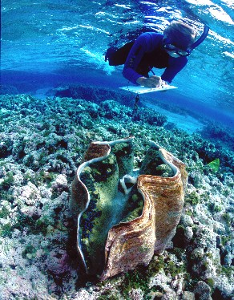
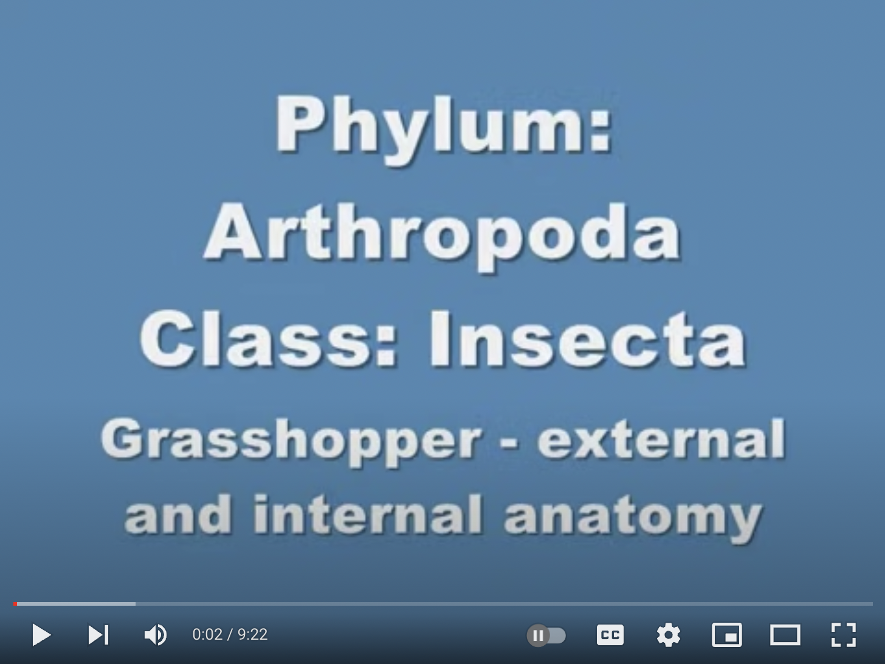

# (PART\*) Lab 6 {-}

# Animal Systems I: Part One {-}

*Last updated `r Sys.Date()`*

### Overview of the Week {-}

The breakdown for this week\'s lab;

1. You will be joining your lab mates and TA during your regular scheduled time but online
2. Your TA will go through a PowerPoint presentation online
3. You will be given time to review all material provided on Canvas
4. You must complete all quizzes for this week\'s lab provided on [Canvas](https://canvas.ubc.ca/) 
5. Your Recommendation Report Draft is due this week.  

See [Canvas](https://canvas.ubc.ca) for assignment due dates.

**Before lab** you will need to read through the information outlined below in Animal Systems Information for three phyla: Annelida, Mollusca and Arthropoda.

In this lab, you will be working your way through the material posted on Canvas online but during your scheduled lab time. Your TA will spend time going over a quick [PowerPoint presentation](https://osf.io/download/sbqe7) regarding these animals. You will then need to spend a fair bit of time going through the different videos, images, and written material provided to ensure you have a solid grasp of these animals before coming to campus next week for your synchronous week. You must complete all quizzes associated with the animals found in animal systems I before **11:59 pm on July 20th**. Even though you will be getting together this week there is no reason you can't start reviewing all this information ahead of time so that you are better prepared to get through the material during your lab section. 

# Animal Systems Information {-}

### Phylum Annelida {-}

*Biology 125 Biology for Science Majors II Lab Manual. Written by Dr. Tristyn Hay October, 2021. Some content provided by the University of British Columbia and Okanagan Biology Graduate Program students handbook The Fictional Animal Project: A Tool for Helping Students Integrate Body Systems. Adv. Physiol. Edu 41: 239-243 Blatch et al. 2017*

The phylum Annelida includes all segmented worms that have a coelom functioning as a hydrostatic skeleton. Other than the first and last portion, they are built on a pattern of repeated segments through which a \“one-way\" digestive tract (mouth and anus), closed circulatory system (blood is completely enclosed in vessels), and nervous system pass. The annelids do not have specialized gas exchange structures, instead the blood vessels pass very close to the bodies surfaces so that, providing the epithelium is kept moist, diffusion across the body surface can meet the metabolic needs of the animals. However, a number of the marine annelids have heavily vascularized flattened extensions on the sides of each segment thus increasing the surface area across which diffusion can occur. The blood of many types of marine annelids is copper based, not iron, thus giving their blood a greenish colour. Some of the freshwater \“earthworms\” however have iron-based blood so it is red like ours. These worms are common in water that lacks much oxygen. As a result, they contain large amounts of hemoglobin, appear very red and are called bloodworms (proper name is Tubifex) and are sold in pet stores as fish food.

**EXTERNAL FEATURES**

Earthworms have a tremendous impact on the soil. By burrowing through soil they increase its porosity and thus allow air and water to penetrate it easily. They also enrich soils by carrying surface material such as dead plant material (detritus) into deeper layers.

**DIGESTION**

Digestion in the phylum Annelida is extracellular. These animals have a complete digestive system, with mouth and anus. Marine worms are filter feeders or scavengers. Earthworms squeeze organic material out of the earth. Just posterior to the mouth opening is the muscular pharynx which contracts to suck food particles into the mouth. The esophagus follows the pharynx, which ends in a thin-walled sac like structure called a crop. The crop opens into a
gizzard, which has thick, muscular walls. Food is passed from the gizzard to the intestine, where
further digestion and absorption occur. The intestine ends at the anus.

**TRANSPORT AND EXCHANGE**

Circulation in the earthworm is through a series of closed vessels. The two main vessels that can
be seen in your dissection are the dorsal and ventral blood vessels. These vessels are the main
pumping structures. In the dorsal vessel, blood moves towards the anterior end. The dorsal vessel
is the dark line running along the dorsal surface of the digestive tract. In the ventral vessel, blood
moves toward the posterior end. Segmental branches off the ventral vessel supply the intestine
and body wall with blood. These branches eventually break into capillary beds to pick up or
release nutrients and, oxygen. Gas exchange occurs between the capillary beds of the body
surface and the environment. Oxygen is carried by the respiratory pigment hemoglobin, which is
dissolved in the fluid portion of the blood. From these capillary beds, blood is collected into larger
vessels that eventually unite with the dorsal vessel. Surrounding the esophagus, segmental branches are expanded into five pairs of aortic arches, or what have been called \"hearts\". They are dark, expanded structures on either side of the esophagus. Although these are contractile, they only function in pumping blood from the dorsal to the ventral vessels.

**EXCRETION AND OSMOREGULATION**

Annelids possess a pair of tubular excretory structures (called metanephridia) per segment.
Metanephridia are open\-ended into the coelomic fluid and are surrounded by capillaries. The internal opening of the metanephridium is surrounded by cilia, which beat and draw fluid into the tube\; the fluid can then pass to the outside of the body via a pore. The metanephridium in annelids has both excretory and osmoregulatory roles. The epithelium lining the inside of the tubule, reabsorbs most solutes and returns them to the blood in the capillaries, whereas ammonium is excreted along with copious amount of water.

**REPRODUCTION**

Annelids are hermaphroditic (both sexes in the same organism). Sexual reproduction occurs through the exchange of sperm packets among different individuals (cross fertilization). The received sperm are stored temporarily while a structure called the clitellum secretes a cocoon of mucus. The cocoon slides along the worm and picks up the eggs and the stored sperm. Some annelids also reproduce asexually by budding off into a separate organism (polychaetes). Look on a diagram to locate the oviduct. 

### Phylum Mollusca {-}

Molluscs, including snails, clams, oysters, squids and octopi, number well over 100,000 species. They appear to be quite diverse but they all have:

* A large ventral muscular foot, which is used in locomotion.
* A visceral mass above the foot which contains a digestive, excretory, circulatory (either openmeaning that blood is not completely contained within blood vessels or closed-meaning that
blood is completely contained within blood vessels-depending on lifestyle) and other organ
systems.
* A mantle is a heavy fold of tissue that covers the visceral mass and in most species contains
glands that secrete a shell. In many species, gills can be found within the mantle cavity\; in
terrestrial species such as snails and slugs the cavity is highly vascularized and is called the
pulmonary cavity.

**DIGESTION**

As molluscs have a range of body structures (eg. Bivalvia have 2 shells whereas Cephalopoda have
none), and generalizations regarding feeding (from suspension to mass feeders) is difficult. In the
case of the clam (filter feeders), the food particles that are filtered from the water by the ctenidia
are carried by water currents to the mouth by labial palps. The esophagus leads the food to the irregularly-shaped stomach, which lies in the greenish digestive gland (equivalent to liver). From the stomach, the intestine extends through the pericardial cavity to the rectum.

**TRANSPORT AND EXCHANGE**

Except for cephalopods, all molluscs have open circulatory systems. In clams, two large sheets
of tubes called the ctenidia lie beside the muscular foot. The molluscs are good at utilizing the same organ for different purposes. Here, ctenidia function both as gills and as devices for filtering food. Water enters the mantle cavity via an incurrent siphon. Numerous cilia on the gills beat to create a current, which draws water into the mantle cavity and through numerous tiny pores in the ctenidia. Oxygen and carbon dioxide are exchanged in the ctenidia, which are supplied with blood and food is trapped. These tubules carry the water to a dorsal suprabranchial cavity that leads to the excurrent siphon where water leaves the body, creating a continuous flow.

**EXCRETION AND OSMOREGULATION**

Most molluscs possess a large pair of metanephridia, frequently referred to as a kidney. The kidney plays a large role in osmoregulation in freshwater forms. A very dilute urine containing ammonium is produced (in aquatic forms) and salts are absorbed across the walls of the metanephridia. Land snails may excrete uric acid. These coelomates have an open circulatory system with a reduced coelom. The atria of the heart function as part of the circulatory system and excretory system. Here waste products are filtered out of the blood via the atria with urine then being excreted into the coelom. Any re-usable products remaining in the urine will be extracted via the nephridia or \“kidneys\” with the final waste products being discharged into the mantle cavity.

**REPRODUCTION**

Reproduction differs between the different classes or sub-phyla of the Mollusca. In the class Bivalvia, in which the clam belongs, reproduction is external. Eggs and sperm are shed into the water and fertilized eggs develop into two stages of larvae. The 2nd staged larva settles on a substrate and metamorphosis occurs resulting in an adult form that secretes a shell. Most clams are hermaphroditic, producing sperm and eggs in the gonads. The production of sperm and eggs can occur simultaneously or at different times. Eggs and or sperm are released into the aquatic environment via the excurrent siphon.

### Phylum Arthropoda {-}

Arthropods are characterized by a jointed chitinous exoskeleton and jointed legs. The exoskeleton serves both as armor and as a point of attachment for their muscles. Since the skeleton limits their growth they must occasionally molt to increase in size. Their circulatory system is open with an elongated dorsal vessel, which is a heart that pumps blood forward into the arteries, from which it empties into open sinuses where it bathes the tissues and then returns
to the posterior portion of the heart.The arthropod phylum is by far the largest with more than a million species. Most of these are in the class Insecta (eg., beetles, butterflies, flies, ants, wasps, grasshoppers, and dragonflies). The other two large groups are the chelicerates (spiders, harvestmen, ticks, mites, scorpions and \"horseshoe crabs\") and the crustaceans (shrimps, crabs, crayfish, barnacles and lobsters). Many different crustaceans can be found in the lakes and ponds of the Okanagan - Shuswap region. 

**DIGESTION**

Insect mouthparts are formed from several pairs of modified appendages. In grasshoppers, they include mandibles, which are used for chewing. In other insects they may be modified for piercing and sucking. The intestine consists of a liner passage that contains a crop, a gizzard, the intestine and the anus.

**TRANSPORT AND EXCHANGE**

Gas exchange in insects is accomplished by a tracheal system of branched chitin lined tubes that infiltrate the body and carry oxygen directly to cells. The tracheal system opens to the outside of the body through spiracles, pores that can control air flow and water loss by opening or closing.

**EXCRETION AND OSMOREGULATION**

Insects and other terrestrial arthropods have unique organs called Malpighian tubules. These tubules function in excretion as well as osmoregulation. The tubules open into the gut of the insect and blind end into the circulatory fluid surrounding the organs. Nitrogenous wastes are actively transported into the lumen of the tubules and travel to and passes into the rectum. Most of the water and solutes are pumped back across the rectal wall. The ammonia is metabolized (which costs energy) to uric acid, an insoluble nearly dry crystal, which is mixed with feces and excreted. Uric acid is far less toxic than ammonia. The insect can reabsorb nearly all the water. This is one of the key systems that have allowed insects to become so successful on land.

**REPRODUCTION**

Reproduction in insects is usually sexual, with separate male and female individuals. Fertilization
is usually internal. In most species, sperm are deposited directly into the female’s ovipositor at
the time of copulation. Many insects mate only once in a life.

# Life Cycles, Dissection Guides, & Videos {-}

### Phylum Annelida {-}

Did you know that an earthworm can range in size from 1 inch to 10 feet!!!

**Earthworm Life Cycle**

**Earthworm Dissection Guide & Video**

Click [here](https://osf.io/download/vzu5f) to download a copy of the Earthworm Dissection Guide.

**Earthworm Quiz**

Complete the Earthworm Quiz on [Canvas](https://canvas.ubc.ca/).

### Phylum Mollusca {-}

Interesting fact: The giant clam has a lifespan well over that of a human!

**Clam Life Cycle**

**Clam Dissection Guide & Video**

Click [here](https://osf.io/download/hy37u) to download a copy of the Clam Dissection Guide.

**Clam Quiz**

Complete the Clam Quiz on [Canvas](https://canvas.ubc.ca/).

### Phylum Arthropoda {-}

Grasshoppers can make music without any instruments. Click [here](https://www.youtube.com/watch?v=nyglT-rWE5c) to listen to their song.

**Grasshopper Life Cycle**

**Grasshopper Dissection Guide & Videos**

Click [here](https://osf.io/download/9uvxh) to download a copy of the Grasshopper Dissection Guide.

**Grasshopper Quiz**

Complete the Grasshopper Quiz on [Canvas](https://canvas.ubc.ca/).

